# HW01 Report — QA/QC Jobs, Software Defects, and Physical Product Testing

**Course:** CS423 — Software Testing  
**Assignment:** HW01-AI  
**Student:** [Full name]  
**Student ID:** [Student ID]  
**Submission date:** [DD/MM/YYYY]

> Complete each section with your own verified research and device-test evidence. Replace all bracketed instructions before submission. Include this Markdown source and its Save-As-PDF copy in the final ZIP.

## 1. QA/QC Job Market 2026+ (40 pts)

### 1.1 Posting Overview

| # | Job Title | Employer | Date Posted | AI/LLM Skill Required? | Salary | Screenshot File |
|---|---|---|---|:---:|---|---|
| 1 | [Hanoi] Fullstack QA Engineer Lead (Manual, Auto, AI) | MONEY FORWARD VIETNAM CO.,LTD | 24/09/2026 | **Yes** | Undisclosed / Thỏa thuận | [`job_01_itviec_moneyforward.png`](Job_Posting_Screenshots/job_01_itviec_moneyforward.png) |
| 2 | Middle QA Automation Engineer (Playwright, Selenium) | FPT Digital | 25/09/2026 | **Yes** | 800 - 1,500 USD | [`job_02_itviec_fptdigital.png`](Job_Posting_Screenshots/job_02_itviec_fptdigital.png) |
| 3 | Automation Tester (QA QC/ Tester/ Japanese N3+) | TrustedAI | 23/09/2026 | **Yes** | 800 - 1,500 USD | [`job_03_itviec_trustedai.png`](Job_Posting_Screenshots/job_03_itviec_trustedai.png) |
| 4 | Manual Tester (Kiểm Thử Phần Mềm) | Viettel Cyber Security | 22/09/2026 | **Yes** | Thỏa thuận | [`job_04_topcv_viettel.png`](Job_Posting_Screenshots/job_04_topcv_viettel.png) |
| 5 | Software Development Engineer in Test (SDET) | ANDPAD VietNam Co., Ltd | 22/09/2026 | **Yes** | Undisclosed / Thỏa thuận | [`job_05_itviec_andpad.png`](Job_Posting_Screenshots/job_05_itviec_andpad.png) |
| 6 | QA Engineer (Tester, QA QC, English) | Saritasa | 24/09/2026 | **Yes** | 1,000 - 1,500 USD | [`job_06_itviec_saritasa.png`](Job_Posting_Screenshots/job_06_itviec_saritasa.png) |
| 7 | Middle/Senior Automation QC (Tester, QA QC) | Saigon Technology | 24/09/2026 | No | Undisclosed / Thỏa thuận | [`job_07_itviec_saigontech.png`](Job_Posting_Screenshots/job_07_itviec_saigontech.png) |
| 8 | Manual Tester | CÔNG TY TNHH VBA TECHNOLOGY | 23/09/2026 | No | 20 – 30 triệu VND | [`job_08_topcv_vbatech.png`](Job_Posting_Screenshots/job_08_topcv_vbatech.png) |
| 9 | Senior Automation Tester (Dự Án E-Banking) | Ngân Hàng SHB | 11/09/2026 | No | Thỏa thuận | [`job_09_topcv_shbbank.png`](Job_Posting_Screenshots/job_09_topcv_shbbank.png) |
| 10 | Sr. QA Engineer (from 6yoe, Automation, English) | YUM! Digital & Technology | 24/09/2026 | No | 2,000 - 2,900 USD | [`job_10_itviec_yumdigital.png`](Job_Posting_Screenshots/job_10_itviec_yumdigital.png) |

* **Total postings:** 10 distinct QA/QC positions.
* **AI/LLM-related postings count:** 6 / 10 (exceeds mandatory requirement of $\ge$ 3).
* **Date-window verification:** All 10 postings published between September 11, 2026 and September 25, 2026, strictly falling within the mandatory 60-day window.

---

### 1.2 Job Posting Details

#### 1. [Hanoi] Fullstack QA Engineer Lead (Manual, Auto, AI) — MONEY FORWARD VIETNAM CO.,LTD
* **Posting URL:** [https://itviec.com/it-jobs/hanoi-fullstack-qa-engineer-lead-manual-auto-ai-money-forward-vietnam-co-ltd-4636](https://itviec.com/it-jobs/hanoi-fullstack-qa-engineer-lead-manual-auto-ai-money-forward-vietnam-co-ltd-4636)
* **Date posted:** 24/09/2026 (Posted 1 day ago)
* **Screenshot File:** [`job_01_itviec_moneyforward.png`](Job_Posting_Screenshots/job_01_itviec_moneyforward.png)
* **Salary:** Undisclosed / Thỏa thuận
* **AI/LLM/AI-automation skill required?:** Yes (Directly tests AI-assisted features like chatbots and agents, and adopts GenAI tools for test design and script generation).
* **Job description:** Principal QA Anchor for B2B SaaS products. Drive team adoption of Generative AI tools (Cursor, GitHub Copilot, LLM assistants) to accelerate test design, script generation, and defect triage. Validate AI-assisted product features (chatbots, agents) and enforce AI privacy and data protection guidelines.
* **Required skills:** Playwright, TypeScript, Python, Cypress/Selenium, REST/GraphQL API testing, SQL, CI/CD, GenAI tooling (Cursor, Copilot, LLM assistants), English fluency.
* **AI Impact Analysis:** While GenAI automates boilerplate test authoring and triage analysis, human QA leadership is crucial to establish strict data privacy boundaries and validate that probabilistic AI agent responses comply with business governance.
* **Evidence Screenshot:**

  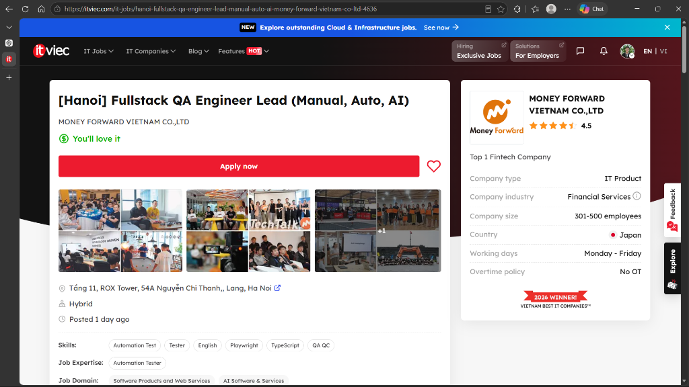

#### 2. Middle QA Automation Engineer (Playwright, Selenium) — FPT Digital
* **Posting URL:** [https://itviec.com/it-jobs/middle-qa-automation-engineer-playwright-selenium-fpt-digital-4422](https://itviec.com/it-jobs/middle-qa-automation-engineer-playwright-selenium-fpt-digital-4422)
* **Date posted:** 25/09/2026 (Posted 1 hour ago)
* **Screenshot File:** [`job_02_itviec_fptdigital.png`](Job_Posting_Screenshots/job_02_itviec_fptdigital.png)
* **Salary:** 800 - 1,500 USD / month
* **AI/LLM/AI-automation skill required?:** Yes (Specializes in testing RAG workflows, prompt stability, hallucination detection, and using AI tools for test generation).
* **Job description:** Design, build, and maintain automated test scripts using frameworks such as Playwright, Selenium, or Cypress for core web and API workflows. Test AI/LLM-driven features (chatbots, RAG workflows, automated extraction) and evaluate AI output quality for hallucinations and prompt consistency.
* **Required skills:** Playwright, Selenium, Cypress, JavaScript, TypeScript, Python, Java, Postman, SQL, Jira, AI/LLM testing, RAG workflows, AI hallucination detection, prompt evaluation, ChatGPT/Claude/Copilot.
* **AI Impact Analysis:** The role shifts from verifying static deterministic outcomes to measuring probabilistic model accuracy and semantic drift, where human testers must craft adversarial prompts to expose hallucination vulnerabilities.
* **Evidence Screenshot:**

  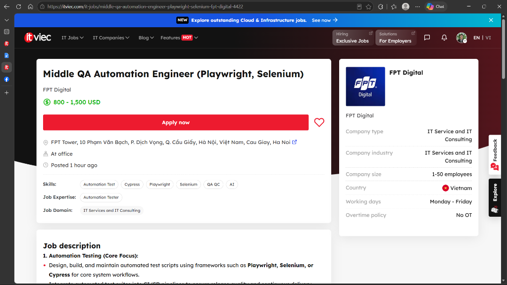

#### 3. Automation Tester (QA QC/ Tester/ Japanese N3+) — TrustedAI
* **Posting URL:** [https://itviec.com/it-jobs/automation-tester-qa-qc-tester-japanese-n3-trustedai-2550](https://itviec.com/it-jobs/automation-tester-qa-qc-tester-japanese-n3-trustedai-2550)
* **Date posted:** 23/09/2026 (Posted 2 days ago)
* **Screenshot File:** [`job_03_itviec_trustedai.png`](Job_Posting_Screenshots/job_03_itviec_trustedai.png)
* **Salary:** 800 - 1,500 USD / month
* **AI/LLM/AI-automation skill required?:** Yes (Applies AI to QA tasks and validates AI/NLP/RAG applications).
* **Job description:** Establish QA processes for an AI startup, build automated regression suites, and test AI products (Chatbot, NLP, RAG) targeting the Japanese market.
* **Required skills:** Automation testing, QA/QC process management, applying AI to testing workflows, testing AI/chatbot/NLP products, Japanese (N3+).
* **AI Impact Analysis:** AI tools accelerate multi-browser script generation and synthetic test data creation, but human domain testing is irreplaceable for evaluating Japanese cultural nuances and context-dependent chatbot responses.
* **Evidence Screenshot:**

  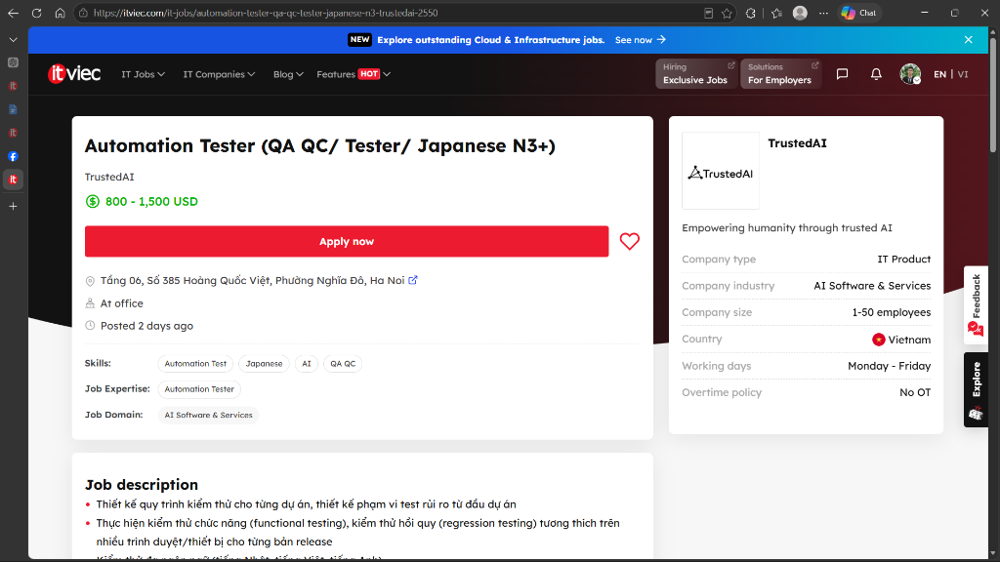

#### 4. Manual Tester (Kiểm Thử Phần Mềm) — Viettel Cyber Security
* **Posting URL:** [https://www.topcv.vn/viec-lam/manual-tester-kiem-thu-phan-mem/2242655.html](https://www.topcv.vn/viec-lam/manual-tester-kiem-thu-phan-mem/2242655.html)
* **Date posted:** 22/09/2026 (Deadline: 31/10/2026)
* **Screenshot File:** [`job_04_topcv_viettel.png`](Job_Posting_Screenshots/job_04_topcv_viettel.png)
* **Salary:** Thỏa thuận / Negotiable
* **AI/LLM/AI-automation skill required?:** Yes (Requires experience/mindset to test AI Agents, GenAI features, and apply AI in testing).
* **Job description:** Formulate test plans, design test cases for enterprise cybersecurity solutions, conduct API and database validations, and apply AI tooling to accelerate QA testing cycles.
* **Required skills:** 5+ years testing experience (Web, Mobile, Desktop, API), SQL, testing LLMs/GenAI/AI Agents, cybersecurity domain knowledge, JMeter.
* **AI Impact Analysis:** AI can rapidly simulate anomalous traffic and generate fuzzing inputs, while human cybersecurity testers remain necessary to discover sophisticated logic flaws and zero-day vulnerabilities in security controls.
* **Evidence Screenshot:**

  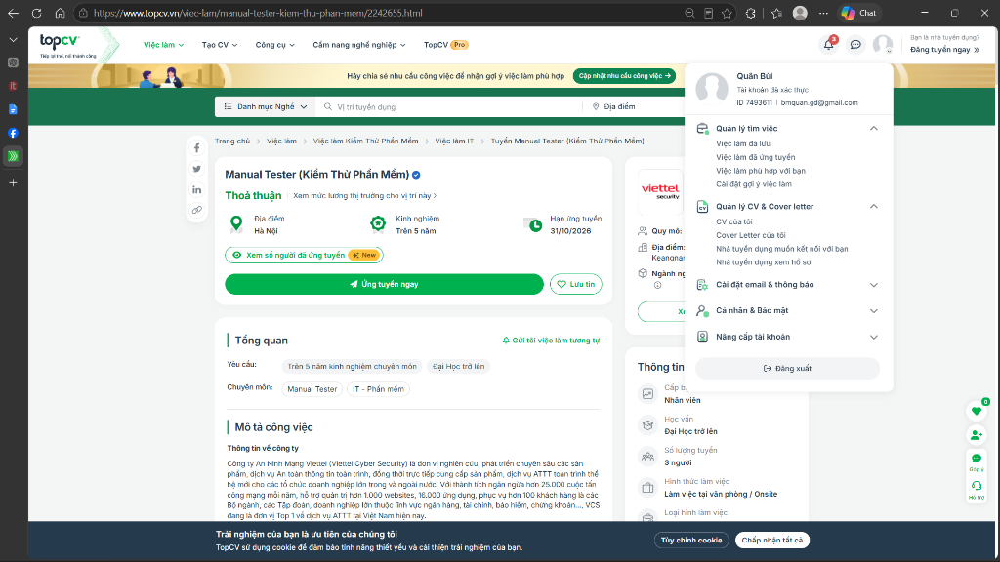

#### 5. Software Development Engineer in Test (SDET) — ANDPAD VietNam Co., Ltd
* **Posting URL:** [https://itviec.com/it-jobs/software-development-engineer-in-test-sdet-andpad-vietnam-co-ltd-4540](https://itviec.com/it-jobs/software-development-engineer-in-test-sdet-andpad-vietnam-co-ltd-4540)
* **Date posted:** 22/09/2026 (Posted 3 days ago)
* **Screenshot File:** [`job_05_itviec_andpad.png`](Job_Posting_Screenshots/job_05_itviec_andpad.png)
* **Salary:** Undisclosed / Thỏa thuận
* **AI/LLM/AI-automation skill required?:** Yes (Designs quality metrics and test strategies specifically for AI-driven platform features).
* **Job description:** Build automation frameworks for cloud and mobile construction tech platforms; collaborate directly with AI engineering teams to define quality metrics and validation strategies for AI-driven platform features.
* **Required skills:** Go, Ruby on Rails, Python, TypeScript, Playwright, Cypress, mobile testing, CI/CD, AI-driven feature validation.
* **AI Impact Analysis:** Automation frameworks increasingly leverage AI for self-healing tests, freeing SDETs to focus on architecting distributed test harnesses and measuring model inference latency under high load.
* **Evidence Screenshot:**

  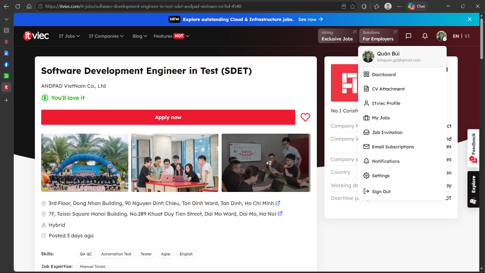

#### 6. QA Engineer (Tester, QA QC, English) — Saritasa
* **Posting URL:** [https://itviec.com/it-jobs/qa-engineer-tester-qa-qc-english-up-to-1500-saritasa-4856](https://itviec.com/it-jobs/qa-engineer-tester-qa-qc-english-up-to-1500-saritasa-4856)
* **Date posted:** 24/09/2026 (Posted 2 days ago)
* **Screenshot File:** [`job_06_itviec_saritasa.png`](Job_Posting_Screenshots/job_06_itviec_saritasa.png)
* **Salary:** 1,000 - 1,500 USD / month
* **AI/LLM/AI-automation skill required?:** Yes (Uses AI tools to accelerate test design and case creation).
* **Job description:** Analyze requirements, author test scenarios, execute functional and regression tests for US/international web and mobile applications, leveraging modern AI productivity tools.
* **Required skills:** 3+ years Manual QA, Postman, JMeter, Git, Web & Mobile testing, AI test design tools, professional English communication.
* **AI Impact Analysis:** Generative AI tools handle routine test case drafting from user stories, allowing QA engineers to spend more time on exploratory user journeys and edge-case integration scenarios.
* **Evidence Screenshot:**

  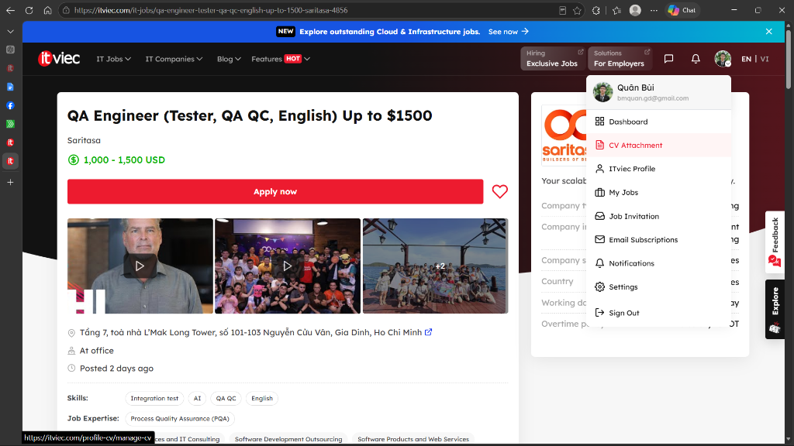

#### 7. Middle/Senior Automation QC (Tester, QA QC) — Saigon Technology
* **Posting URL:** [https://itviec.com/it-jobs/middle-senior-automation-qc-tester-qa-qc-saigon-technology-4350](https://itviec.com/it-jobs/middle-senior-automation-qc-tester-qa-qc-saigon-technology-4350)
* **Date posted:** 24/09/2026 (Posted 1 day ago)
* **Screenshot File:** [`job_07_itviec_saigontech.png`](Job_Posting_Screenshots/job_07_itviec_saigontech.png)
* **Salary:** Undisclosed / Thỏa thuận
* **AI/LLM/AI-automation skill required?:** No
* **Job description:** Design and maintain automated testing frameworks using Playwright (TypeScript/JavaScript); execute automated UI, API, and integration suites; integrate checks into CI/CD pipelines.
* **Required skills:** Playwright (4+ years), JavaScript/TypeScript, Page Object Model, API testing (Postman), CI/CD, English.
* **AI Impact Analysis:** AI code assistants boost scripting speed and suggest assertions, while the human engineer remains responsible for test architecture maintainability, flaky test debugging, and pipeline reliability.
* **Evidence Screenshot:**

  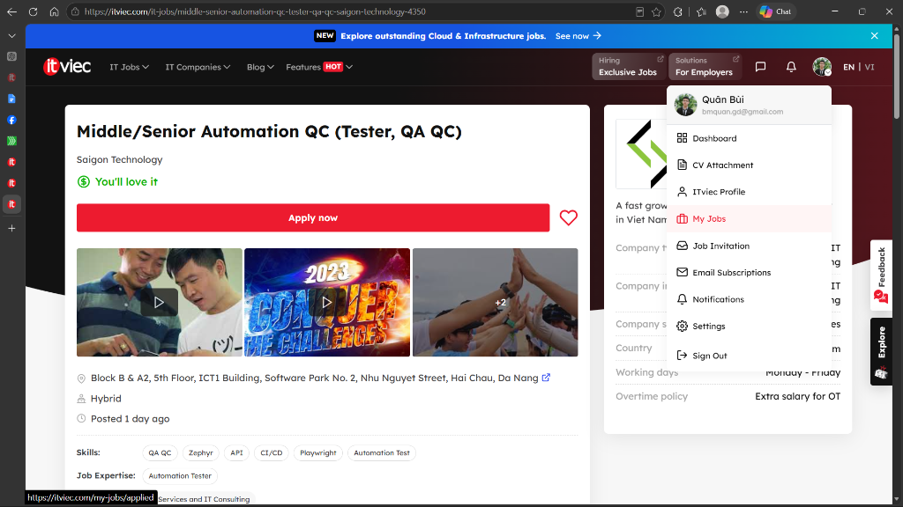

#### 8. Manual Tester — CÔNG TY TNHH VBA TECHNOLOGY
* **Posting URL:** [https://www.topcv.vn/viec-lam/manual-tester/2310538.html](https://www.topcv.vn/viec-lam/manual-tester/2310538.html)
* **Date posted:** 23/09/2026 (Deadline: 30/10/2026)
* **Screenshot File:** [`job_08_topcv_vbatech.png`](Job_Posting_Screenshots/job_08_topcv_vbatech.png)
* **Salary:** 20,000,000 – 30,000,000 VND / month
* **AI/LLM/AI-automation skill required?:** No
* **Job description:** Create test plans, design test cases, execute testing for core banking and financial systems, write SQL queries for database verification, and log bugs in tracking systems.
* **Required skills:** 2+ years testing experience, Banking/Financial domain knowledge, Web/App/DB testing, Postman, SQL, Agile.
* **AI Impact Analysis:** AI can assist in synthesizing complex banking test data permutations, but human testers are indispensable for verifying financial reconciliation rules, regulatory compliance, and transaction integrity.
* **Evidence Screenshot:**

  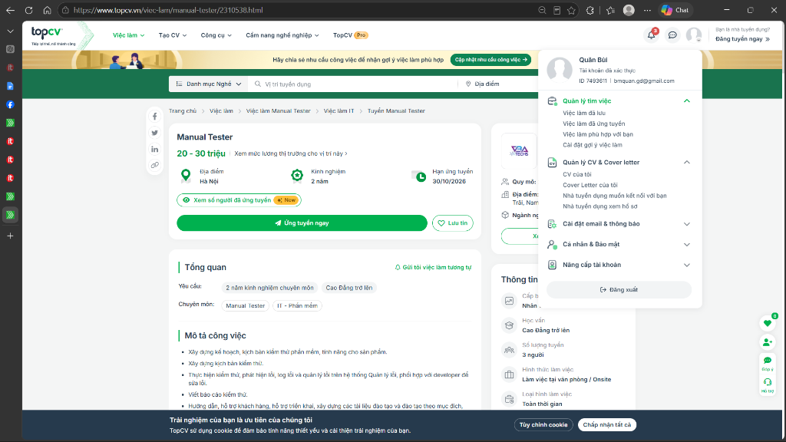

#### 9. Senior Automation Tester (Dự Án E-Banking) — NGÂN HÀNG SHB
* **Posting URL:** [https://www.topcv.vn/viec-lam/senior-automation-tester-du-an-e-banking/1159023.html](https://www.topcv.vn/viec-lam/senior-automation-tester-du-an-e-banking/1159023.html)
* **Date posted:** 11/09/2026 (Deadline: 03/10/2026)
* **Screenshot File:** [`job_09_topcv_shbbank.png`](Job_Posting_Screenshots/job_09_topcv_shbbank.png)
* **Salary:** Thỏa thuận / Negotiable
* **AI/LLM/AI-automation skill required?:** No
* **Job description:** Architect test automation frameworks for digital banking systems (UI, API, Integration); conduct performance testing (load, stress, endurance) and embed quality gates into CI/CD pipelines.
* **Required skills:** Java (OOP, SOLID), UI & API test automation, Performance Testing, Serenity BDD, Selenium, CI/CD Jenkins, Banking domain.
* **AI Impact Analysis:** AI helps detect anomalies in massive performance test telemetry, while human senior engineers must diagnose concurrency bottlenecks, thread locks, and failover resilience.
* **Evidence Screenshot:**

  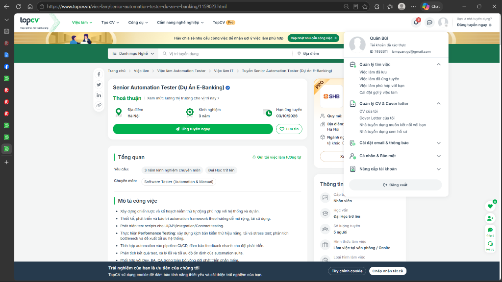

#### 10. Sr. QA Engineer (from 6yoe, Automation, English) — YUM! Digital & Technology
* **Posting URL:** [https://itviec.com/it-jobs/sr-qa-engineer-from-6yoe-automation-english-yum-digital-technology-5203](https://itviec.com/it-jobs/sr-qa-engineer-from-6yoe-automation-english-yum-digital-technology-5203)
* **Date posted:** 24/09/2026 (Posted 20 hours ago)
* **Screenshot File:** [`job_10_itviec_yumdigital.png`](Job_Posting_Screenshots/job_10_itviec_yumdigital.png)
* **Salary:** 2,000 - 2,900 USD / month
* **AI/LLM/AI-automation skill required?:** No
* **Job description:** Drive quality standards and automation testing for the global e-commerce platform powering KFC and Taco Bell; build multi-platform frameworks (Playwright, Cypress, Appium) and conduct exploratory testing.
* **Required skills:** 6+ years QA experience, Playwright/Cypress/Selenium/Appium, high-volume consumer e-commerce, CI/CD integration, English fluency.
* **AI Impact Analysis:** AI visual testing tools automate cross-device UI comparison at scale, while senior human testers focus on order fulfillment edge cases, payment failure recovery, and peak-traffic user journeys.
* **Evidence Screenshot:**

  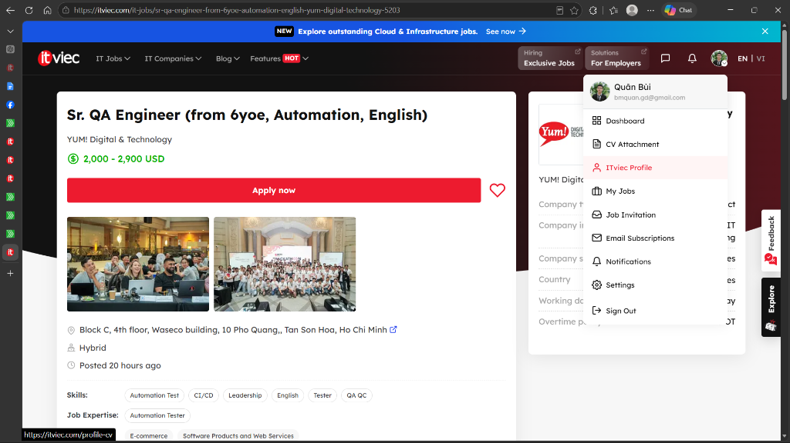

---

### 1.3 CLO G9.1 — QA/QC Role & ISTQB Process Mindmap Audit

#### AI Mindmap Artifact
Below is the initial AI-generated mindmap (`QAQC_Role_Mindmap.png`) representing Quality Assurance (QA) versus Quality Control (QC) and the testing process activities:

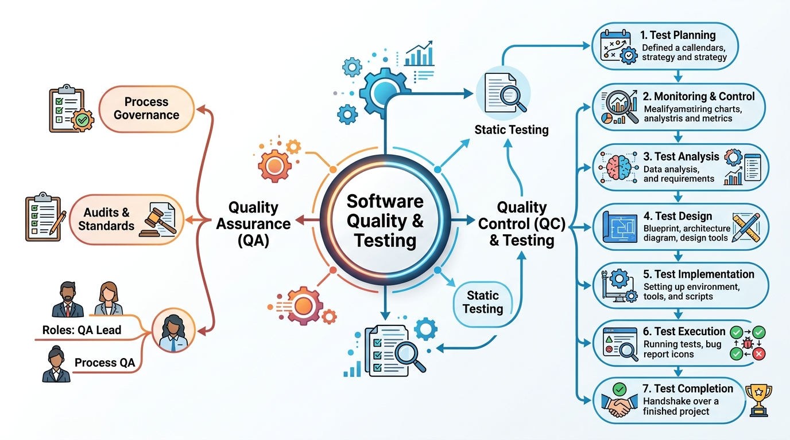

#### AI Mindmap Audit & Corrections (G9.1 Understand)
To fulfill the Bloom-AI Level **G9.1 (Understand)** requirement, the student conducted a rigorous critical evaluation of the AI-generated mindmap against the official **ISTQB Certified Tester Foundation Level (CTFL) v4.0.1 Syllabus**. This audit identified **3 major structural and conceptual defects**, detailed with ISTQB evidence and student corrections below:

| # | AI Mistake / Defect in Diagram | Evidence from ISTQB CTFL v4.0.1 Syllabus | Student Correction Applied |
|---|---|---|---|
| **1** | **Misrepresentation of "Test Monitoring & Control":** The diagram models *"2. Monitoring & Control"* as an isolated, discrete step placed linearly between Planning and Analysis. | **ISTQB CTFL v4.0.1 Section 1.4 & Section 5.3:** Testing activities do not follow a rigid linear waterfall sequence; Monitoring & Control is an ongoing, continuous activity that spans all test phases to track progress and execute corrective actions. | Modeled Test Monitoring & Control as an overarching, continuous feedback and governance loop that spans across all testing activities (from planning to completion) rather than a linear standalone block. |
| **2** | **Misplaced and Detached "Static Testing" Flow:** The diagram features *"Static Testing"* as disconnected nodes floating in the middle, with an incorrect directional arrow linking into *"Test Planning"*. | **ISTQB CTFL v4.0.1 Chapter 3:** Static testing consists of reviewing work products (such as requirements, designs, and user stories) and performing static code analysis without execution. It serves as an early defect prevention technique rather than an arbitrary sub-process feeding into Test Planning. | Clarified that Static Testing operates on requirements, user stories, and specifications during early lifecycle activities (Shift-Left), serving as defect prevention rather than an isolated pre-planning feeder. |
| **3** | **Complete Omission of Testing/QC Roles:** While the QA branch explicitly defines organizational roles (*"QA Lead, Process QA"*), the QC & Testing branch merely lists procedural steps (1 to 7) without a single human job title. | **ISTQB CTFL v4.0.1 Section 1.4:** The syllabus establishes two fundamental role profiles: the **Test Management role** (responsible for planning, monitoring, and control) and the **Testing role** (e.g., Test Analyst, Test Engineer, Automation Tester). Omitting human job titles violates the core HW01 requirement for a "QA/QC Role Mindmap". | Explicitly mapped human testing roles (Test Management / QA Lead, Test Analyst, Technical Test Analyst, Automation Tester, SDET) to the corresponding activities in the test process. |

*(Note: Full verbatim prompt, artifact image evaluation, and ISTQB reasoning are logged in Section 4 and `AI-02_AI_Audit_Report.md` as Artifact #1).*

## 2. Software Defects 2022–2026 (20 pts)

[Document 20 publicized software defects from 2022–2026. For each include a source link, description, severity, consequences, and solution/mitigation. At least 5 must relate to AI/LLM. Identify at least one hallucination or bias in an AI explanation of a defect and correct it.]

## 3. Physical Product Test Design and Execution (rubric: 25 pts)

[Identify one physical household product you own. State brand, model, year, and serial number with the middle four characters masked. Include the device photo with your student ID card in the same frame.]

### Test design and results

[Summarize the 15 test cases here. The Excel workbook must contain Objective, Input, Steps, Expected, Actual, and Verdict for each test case. Include at least 3 edge cases AI failed to identify and explain your G9.3 analysis.]

### Execution evidence

[Report the results of at least 5 tests executed on the real device. List at least 5 YouTube Unlisted video URLs. Each video must be at most 60 seconds and include your own voice narration.]

## 4. AI Audit Report

[Include the AI audit summary here and attach the detailed AI-02 report. Audit every AI-generated artifact using the five required sections. Include VALID / INVALID / INCOMPLETE counts and percentages, then state when AI should and should not be used for this work.]

## 5. AI Critique (200–300 words)

[Write 200–300 words covering where AI was wrong, biased, or incomplete; why it failed to catch the issue; and what you learned about collaborating with AI on this assignment.]

## 6. Mandatory Disclosure

> [Replace this with the course's standard disclosure statement. Name the AI tool, identify which sections/artifacts AI initially generated, what you reviewed or modified, which edge cases you added, which sections you wrote yourself, and refer to Appendix A. Confirm accurately that prohibited evidence was not AI-generated.]

## 7. References

[Add the sources cited in the report using the course-required citation style.]

## Appendix A

See `Appendix_A_Prompt_Log.md` for the complete prompt log with timestamps.

## Self-Assessment

[This must be the final section of the report. Complete each row and the total based on the official rubric and any instructor clarification of the Requirement 3 point discrepancy.]

| Criterion | Available points | Self-assessed points |
|---|---:|---:|
| Job Market 2026+ | 40 | [ ] |
| Software Defects 2022–2026 | 20 | [ ] |
| Physical-product test design | 25* | [ ] |
| AI-02 AI Audit Report | 8 | [ ] |
| AI Critique + AI-03 Disclosure | 4 | [ ] |
| AI-05 Checklist + anti-cheat artifacts | 3 | [ ] |
| **Total** | **100** | **[ ]** |

*The Requirement 3 heading says 40 points, but the final rubric allocates 25. Confirm the applicable score with course staff before finalizing.
